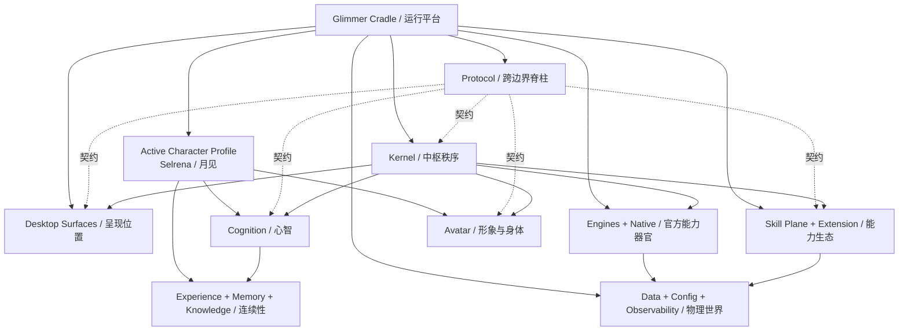
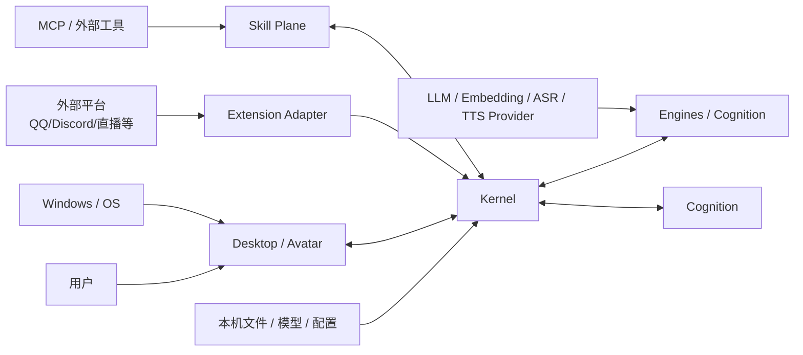
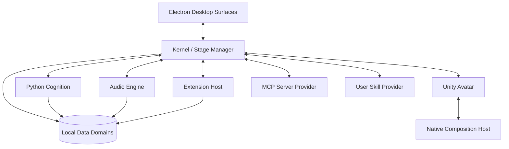
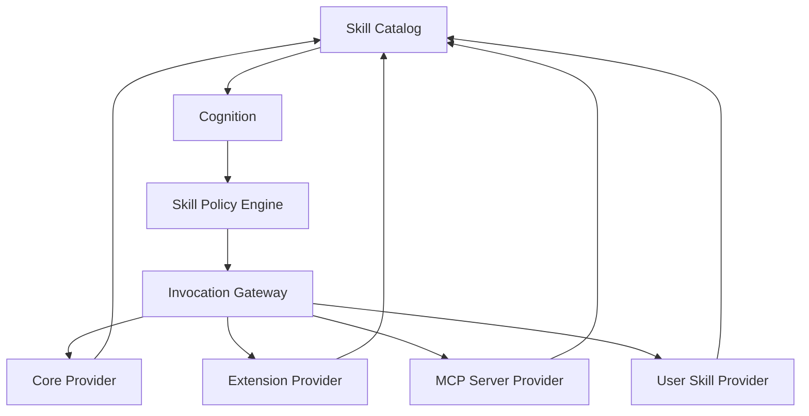

# Glimmer Cradle 架构蓝图（Glimmer Cradle Architecture Blueprint）

> 范围：Glimmer Cradle 作为本地优先数字生命体企划与运行平台的长期架构宪法、模块定位、概念模型、运行拓扑、边界原则、质量属性和设计审美；当前默认角色是 Selrena（月见），但平台层不绑定单个角色；不声明当前代码已经全部落地，也不保存字段表、命令步骤或阶段任务。
> 事实依据：历史架构蓝图、`history/legacy-current-architecture/`、`history/legacy-extensions/`、阶段 ADR、当前 Architecture/Current/Implementation/Reference、代码目录和配置事实。
> 维护触发：产品本质、长期不变量、模块归属、进程边界、Extension/Skill Plane 模型、数据归属、身体架构、协议脊柱、安全模型或架构审美发生变化。

## 目录

| 章节 | 读者问题 |
|---|---|
| [0. 蓝图契约](#0-蓝图契约) | 这份蓝图负责什么，如何与 Current/Implementation/Reference 分工 |
| [1. 架构宪法](#1-架构宪法) | Glimmer Cradle 与默认角色 Selrena 的关系是什么，哪些原则不可违背 |
| [2. 项目模块定位总图](#2-项目模块定位总图) | Protocol、Kernel、Cognition、Desktop、Avatar、Engine、Extension 等模块在生命体中处于什么位置 |
| [3. 系统上下文与信任边界](#3-系统上下文与信任边界) | 角色运行时如何面对用户、桌面、平台、模型、扩展、MCP 和本机数据 |
| [4. 运行拓扑与崩溃域](#4-运行拓扑与崩溃域) | 长期运行时由哪些进程/容器组成，失败如何隔离 |
| [5. Protocol：跨边界脊柱](#5-protocol跨边界脊柱) | 什么必须进入协议，协议如何保持跨语言一致 |
| [6. Kernel：中枢、监督树与秩序](#6-kernel中枢监督树与秩序) | Kernel 为什么是 Stage Manager，如何管理生命周期、Ingress、权限和投影 |
| [7. Cognition：认知核与心智主权](#7-cognition认知核与心智主权) | 当前激活角色的心智、人格、情绪、记忆、推理和行动语义如何归属 |
| [8. 经历、记忆、知识与身份](#8-经历记忆知识与身份) | 连续身份如何通过 Ledger、Episode、Memory、Relationship 与 Knowledge 构成 |
| [9. Avatar、Host 与 Surface](#9-avatarhost-与-surface) | 人物形象、实现进程与呈现位置如何保持同一身体但边界清楚 |
| [10. Engines 与 Native：官方能力器官](#10-engines-与-native官方能力器官) | Audio/Vision/Vector/Reasoning 与 native 热路径为何不是 Extension |
| [11. Extension 与 Skill Plane：能力生态](#11-extension-与-skill-plane能力生态) | Extension 的定位是什么，Skill Plane 如何统一 Core/Extension/MCP/User 能力 |
| [12. 数据、配置与安全](#12-数据配置与安全) | 状态、模型、缓存、日志、密钥和权限如何分域 |
| [13. 可观测性与解释](#13-可观测性与解释) | 角色生命因果和平台运行故障如何解释 |
| [14. 关键运行场景](#14-关键运行场景) | 启动、输入、回复、Skill 调用、Extension Adapter、Avatar 表达和停机如何串起来 |
| [15. 质量属性](#15-质量属性) | 如何判断架构是否保持连续、可靠、可解释、可演进 |
| [16. 架构审查清单](#16-架构审查清单) | 新设计进入主线前必须回答哪些问题 |
| [17. 演进治理](#17-演进治理) | 蓝图、Current、Implementation、Reference、Guide、Roadmap 如何共同演进 |
| [18. 术语表](#18-术语表) | 跨文档必须统一使用的核心术语 |

## 0. 蓝图契约

蓝图是 Glimmer Cradle 的架构宪法。它回答：

- Glimmer Cradle 是什么，不是什么；
- Selrena（月见）作为当前默认角色如何落在平台之上；
- 数字生命体运行时为什么要按这套精神和边界设计；
- 每个项目模块在数字生命体中的位置是什么；
- 哪些概念是长期不变量；
- 哪些能力属于本体器官，哪些属于生态扩展；
- 新设计如何判断是否符合 Glimmer Cradle 的概念完整性。

蓝图不回答：

- 当前代码已经落地到什么程度：见 [Current](../current/README.md)；
- 某个类、函数、目录如何实现：见 [Implementation](../implementation/README.md)；
- 字段、配置、SDK、路径、日志的精确事实：见 [Reference](../../reference/README.md)；
- 开发、排障、打包、迁移的步骤：见 [Guides](../../guides/README.md)；
- 下一阶段承诺和验收门：见 [Roadmap](../../roadmap/README.md)。

如果蓝图和 Current 冲突：

1. 以 Current 描述当前事实；
2. 以蓝图判断长期方向；
3. 在 Roadmap 或 ADR 中说明偏差和收口策略；
4. 不得把未来形态写成已落地事实。

蓝图可以描述目标形态，但必须保持概念可落地：每个模块都能追溯到 owner、边界、契约、生命周期和验证方式。

## 1. 架构宪法

### 1.1 宪法宣言

> Glimmer Cradle 是承载连续数字生命体的本地优先运行平台。当前默认主体 Selrena（月见）有觉醒与休眠的节律；她经历过的一切，包括她自己的思考，沉淀为一条可追溯的经历之流；桌面、平台、工具和扩展是她面对世界的剧场。架构的全部目的，是让当前角色主体以及未来角色 profile 在本地优先的环境中，以可负担、可解释、可恢复的方式持续存在。

这句话是 Glimmer Cradle 架构的最高法。它包含四个关键词：

| 关键词 | 含义 |
|---|---|
| 连续身份 | 当前激活角色不是每次对话重新出生的聊天机器人；人格、情绪、记忆、关系、外观偏好跨会话延续 |
| 认知主体 | 当前激活角色不是模型路由器；她通过 Cognition 形成感知、评价、召回、推理、巩固、决意和行动 |
| 生命节律 | 当前激活角色不是永远满速空转的后台程序；Cognitive Activity 按 engaged、ambient、quiescent 调整认知资源，记忆维护使用独立节拍 |
| 世界剧场 | 桌面、QQ/Discord/直播、MCP、文件、工具和 Extension 都是角色行动的场景，不是平台本体本身 |

一句话概括：

> Glimmer Cradle 提供秩序、身体、能力生态和数据脊柱；当前角色 Selrena（月见）作为一条连续的经历之流，在 Cognition 中形成心智，在 Kernel 中获得秩序，以 Avatar 拥有形象和身体，通过 Surface 与用户相遇，并经 Skill Plane 与 Extension 触达世界。

### 1.2 Glimmer Cradle 不是什么

| 不是 | 原因 |
|---|---|
| 普通聊天客户端 | 聊天只是外显之一；核心是角色连续身份、经历、记忆、身体和主动性 |
| UI 壳 | Control Center 和 Presence 服务于生命体运行，不是产品本体 |
| 模型调用集合 | LLM、ASR、TTS、Vision、Embedding 是器官或能力，不是月见本人 |
| 通用扩展宿主 | Extension 是生态边界；本体器官不通过扩展拼出来 |
| 自动化工具箱 | Skill Plane 让月见会做事，但“做事”必须服从 Cognition、Kernel、权限和审计 |
| 云端优先服务 | 本地连续性、隐私、身体存在和用户数据主权是核心体验 |
| 历史兼容壳集合 | Git 保存历史；运行时只保留当前清晰主线 |

### 1.3 架构审美：概念完整性

Glimmer Cradle 的架构审美不是“把所有能力都堆起来”，而是概念完整性（Conceptual Integrity）和架构自洽性（Architectural Coherence）。

它像一个多面但同构的几何体：

- **多面但同构**：Cognition、Kernel、Desktop、Avatar、Engine、Extension 各自强大，但共享同一套协议、生命周期、权限和命名语言。
- **复杂但连续**：新能力不是临时补丁，而是从现有概念自然长出。
- **分层但不割裂**：边界清楚，但边界之间靠 Schema、Port、Projection、Policy 协作，不靠私有字符串和无限 fallback 粘住。
- **可降级但不欺骗**：没有 ready 就不能伪装 ready；降级必须可见、可解释、可恢复。
- **无多余边角**：如果一个模块只能靠历史解释，不能从当前蓝图推出存在理由，就应删除、重命名或重塑。

### 1.4 不可违背原则

| 原则 | 含义 |
|---|---|
| 认知主权属于 Cognition | 人格、情绪、记忆、推理、巩固和行动语义不下放给 Kernel、Renderer、Extension 或 Engine |
| 秩序主权属于 Kernel | 生命周期、Ingress、监督、路由、权限、状态投影和能力编排由 Kernel 统一治理 |
| Avatar 是一等公民 | Avatar 是 Character 的本体领域；Desktop 只是人物出现和交互发生的 Surface |
| 经历之流优先 | 生命连续性来自经历和记忆，不来自日志、缓存、UI store 或 provider transcript |
| 协议先于跨边界实现 | 跨语言、跨进程和公开 SDK 结构必须先进入 Protocol/Port，再进入生产者和消费者 |
| 生态能力不是本体器官 | Extension/MCP/User Skill 可以扩展世界入口，但不能替代 Cognition、Kernel、Audio、Avatar 或 Native |
| Readiness 必须真实 | 进程存在、端口连接、资源 warmup、首帧呈现、业务可服务是不同状态 |
| 本地状态受保护 | 用户连续性、密钥、模型、日志和备份按生命周期分域，不互相混用 |

### 1.5 五根脊柱

五根脊柱是 Glimmer Cradle 角色运行时的承重结构：

| 脊柱 | 是什么 | 解决什么 | 典型 owner |
|---|---|---|---|
| 经历之流 | append-only Moment stream，记录当前激活角色活过的每一刻 | 连续身份、崩溃恢复、回放、内省 | Cognition |
| 认知循环 | Sense → Appraise → Recall → Compete → Broadcast → Deliberate → Intend → Act → Consolidate | 持续存在、沉默不等于无感、主动性 | Cognition |
| 全局工作区 | 容量有限的“现在”和工作记忆 | 注意力竞争、打断、意识焦点 | Cognition |
| 上下文装配 | 将人格、记忆、知识、关系、场景、多模态资料按预算装配为上下文 | 消除记忆/知识孤岛，控制成本和相关性 | Cognition |
| 因果链 | Moment causation 与 trace/span 双线穿透 | 解释“她为什么这样做”和“机器哪里慢” | Cognition + Kernel |

没有挂到脊柱、身体、秩序、能力生态或可观测性上的模块，默认不是架构承重件。

## 2. 项目模块定位总图

### 2.1 生命体模块图



### 2.2 模块定位矩阵

| 模块 | 生命体位置 | 拥有 | 不拥有 | 判断句 |
|---|---|---|---|---|
| Protocol | 骨架和神经接口 | 跨语言/进程/SDK 稳定契约、Schema、生成投影 | 业务判断、UI view model、临时 helper | “两个边界都要理解”就先进入 Protocol |
| Kernel | 中枢与舞台监督 | 生命周期、Ingress、路由、权限、Skill Plane、状态投影、子进程监督 | 人格、情绪、长期记忆语义、窗口渲染 | Kernel 管秩序，不替月见思考 |
| Cognition | 心智 | 人格、情绪、经历、记忆、关系、推理、巩固、行动语义 | 平台 IO、窗口、扩展进程、provider key UI | Cognition 决定“这对我意味着什么” |
| Desktop Surfaces | 可见管理表面 | Control Center、Presence、托盘、preload 白名单、状态呈现 | Avatar、系统事实源、模型编排、Cognition 私有状态 | Surface 只呈现投影和发出受控 intent |
| Avatar | Character 的形象与身体 | Avatar Package、状态、动作、行为、模型语义与呈现意图 | 人格、推理、Desktop 窗口、Extension 权限 | Avatar 属于人物本体，不是 Surface 或外挂 |
| Avatar Host | Avatar 实现容器 | 进程、模型 driver、渲染后端、Host 协议与资源 gate | Character 身份、Avatar 状态事实、Surface | 当前具体实现是 UnityAvatarHost |
| Engines | 官方能力器官 | TTS、ASR、Vision、Vector、Reasoning 等模型/媒体能力 | 生态扩展、全局编排、人格判断 | 默认能力要纳入 readiness，不走 Extension 冒充 |
| Native | 平台热路径 | Composition、FFI、DPI、多显示器、低延迟媒体、未来加速 | 产品状态、配置 owner、语义判断 | Native 提供原语，不拥有业务 |
| Extension | 生态能力单元 | 平台适配、工具、资源、UI 入口、知识/场景/内容贡献 | Kernel 内部对象、本体器官、Cognition 私有状态 | Extension 是月见向世界生长的边界 |
| Skill Plane | 能力运行平面 | Core/Extension/MCP/User Provider 的 catalog、policy、gateway、audit | 直接思考、直接 UI handler、绕过授权执行 | Skill Plane 统一“我会什么” |
| Data | 物理连续性 | state、models、packages、cache、work、observability、backups、run 分域 | 源码事实源、安装包、密钥明文 | 不可再生状态、可重建材料与短期协调必须分开 |
| Config | 本地配置事实源 | system/cognition/extensions 配置、Schema 校验、冻结投影 | 密钥泄露、运行缓存、用户 DB | Runtime 消费投影，不消费随意 YAML |
| Observability | 运行解释底座 | logs、trace、metrics、DLQ、process log、diagnostics | 生命记忆、用户事实、长 payload 仓库 | 它解释机器，不替代经历 |

### 2.3 器官、能力、表面、投影

很多架构混乱来自把四类东西混叫“模块”：

| 类别 | 定义 | 例子 | 错误做法 |
|---|---|---|---|
| 器官 | 当前角色长期存在所需的核心能力 | Cognition、Kernel、Audio Engine、Avatar | 做成 Extension 或可选扩展 |
| 能力 | 月见可调用、可授权、可禁用的外部行动能力 | MCP tool、Extension skill、用户脚本、Core skill | 绕过 Policy 直接执行 |
| 表面 | 用户看到或操作月见的位置 | Control Center、Presence、桌面、直播、未来 AR | 当作 Avatar 或系统事实源 |
| 投影 | 面向 UI、catalog、diagnostics 的只读视图 | runtime snapshot、skill catalog、diagnostics card | 反向写事实源 |

“能力是扩展，器官不是”应按这个口径理解：
**生态贡献都应以 Extension/Provider 进入；本体器官不能为了统一而塞进 Extension。**

### 2.4 顶层目录的架构含义

| 目录 | 蓝图含义 |
|---|---|
| `protocol/` | 跨语言、跨进程和公开 SDK 的契约源头 |
| `core/kernel/` | TypeScript 中枢、生命周期、能力平面和投影层 |
| `core/cognition/` | Python 认知核、经历、记忆、推理与巩固 |
| `products/desktop/` | Glimmer Cradle Desktop 产品组合；内部按 main / preload / renderer 进程边界分层 |
| `products/personal-server/` | Glimmer Cradle Personal Server 产品组合；无桌面部署与远程接入边界 |
| `core/avatar/unity-host/` | UnityAvatarHost 具体实现；Avatar 领域位于其上，不等同于 Unity |
| `engines/` | 官方模型/媒体能力执行器 |
| `native/` | C/C++ 平台原语与性能热路径 |
| `data/packages/extensions/` | 扩展安装态；第一方源码、第三方源码与审核 Registry 分属独立仓库 |
| `configs/` | 本地配置事实源和冻结配置投影输入 |
| `assets/` | 随应用发布的只读默认资产 |
| `data/` | 本机状态、模型、缓存、可观测性、备份、legacy |
| `docs/` | 架构、实现、参考、指南、路线图和历史证据 |

精确目录事实见 Current、Implementation 和 Reference；蓝图只保留长期归属。

## 3. 系统上下文与信任边界

### 3.1 外部世界



月见面对的外部世界分五类：

| 边界 | 关注点 |
|---|---|
| 用户边界 | 可见状态、确认、配置、隐私、数据恢复、体验连续性 |
| 桌面/OS 边界 | 窗口、托盘、麦克风、摄像头、截图、文件、剪贴板、Native 权限 |
| 平台边界 | QQ/Discord/直播等 payload 清洗、身份映射、限流、输出副作用 |
| 模型/provider 边界 | 成本、密钥、延迟、失败、脱敏、模型 readiness |
| 生态能力边界 | Extension、MCP、User Skill 的权限、审计、可撤销和故障隔离 |

### 3.2 信任模型

| 对象 | 信任程度 | 原则 |
|---|---|---|
| 用户本地状态 | 高价值敏感资产 | 默认保护、备份、迁移前快照 |
| Kernel 内部 service | 可信但不外泄 | 只能通过 Port/Projection 暴露 |
| Cognition 私有状态 | 高敏感心智域 | 不被 Extension、Renderer、Engine 直接访问 |
| Renderer | 低信任表面 | 只通过 preload 白名单访问能力 |
| Extension/MCP/User Skill | 可授权但不完全可信 | manifest、permissions、policy、gateway、audit |
| LLM/provider 输出 | 不可信语义输入 | 不能直接成为事实源；写记忆需 Cognition 判断 |
| 日志/trace/DLQ | 诊断材料 | 不写密钥和完整隐私 payload |

### 3.3 平台适配的结构位置

平台 Adapter 是 Extension 的一种典型贡献，不是 Cognition 的一部分。它负责：

- 接入平台协议；
- 清洗平台私有 payload；
- 映射 scene/source/identity；
- 将输入变成统一感知；
- 将月见输出转成平台动作；
- 处理平台限流、断连和重连。

它不负责：

- 判断月见是否应该回应；
- 生成回复；
- 写长期记忆；
- 修改人格；
- 控制 Kernel 生命周期；
- 管理 provider key。

这条边界保证“外部平台是剧场”，但不是月见的大脑。

## 4. 运行拓扑与崩溃域

### 4.1 长期容器视图



长期结构是一族 runtime，而不是一个进程里堆所有功能。每个 runtime 必须说明：

- 唯一 owner；
- 独立原因；
- 生命周期；
- ready 条件；
- degraded/failed 语义；
- 停机和重启策略；
- 日志与诊断位置。

### 4.2 崩溃域

| 崩溃对象 | 应有影响 | 不应发生 |
|---|---|---|
| Cognition | 心智离线，Kernel 标记不可服务或按策略重启 | UI 继续假装可聊天、消息进入黑洞 |
| Kernel | 全局监督停止，需要整体恢复 | 子系统独立继续写同一事实源 |
| Desktop | 桌面不可见，Cognition/Kernel 可存活 | UI store 变成事实源 |
| Avatar | 身体 degraded，文本/Control Center 可继续 | Presence 冒充正式身体 ready |
| Audio Engine | 语音输入/输出 degraded，文本主线继续 | TTS 失败删除文本回复 |
| Extension | 单扩展失败，撤销其 catalog/Port/handler | 扩展拖垮 Kernel 或留下旧 handler |
| MCP Server | 对应 provider degraded，工具不可调用 | catalog 继续显示假 ready 工具 |
| Native | 透明/合成/热路径 degraded | 业务语义被 native 崩溃污染 |

### 4.3 Readiness 语言

月见必须区分：

```text
process online
  -> transport connected
  -> config loaded
  -> resource prepared
  -> protocol handshake
  -> domain warmup
  -> business ready
  -> user input admitted
```

没有经过业务 ready 的能力不能宣告 ready。可降级能力不能伪装为完整可用。

## 5. Protocol：跨边界脊柱

Protocol 是月见多语言、多进程、多表面的稳定语义脊柱。

### 5.1 进入 Protocol 的条件

| 应进入 Protocol | 不应进入 Protocol |
|---|---|
| TS/Python/Unity/Extension 都要理解的 payload | 单进程内部类 |
| IPC、WebSocket、stdio、SDK 的稳定 envelope | 临时测试 helper |
| Avatar frame | Unity/Cubism 内部运行对象 |
| 错误 code、trace、runtime snapshot 的共享结构 | UI 本地 view model |
| 配置 Schema 和生成投影 | 手写消费者镜像 |
| Extension SDK 可见契约 | Kernel 内部 service 类型 |

### 5.2 协议原则

- Schema-first；
- 生成物只读；
- 跨语言不手写镜像；
- 破坏性变更显式迁移；
- 错误 code 稳定；
- trace 跨边界延续；
- 高频 frame 紧凑；
- 不保留无期限双轨；
- Protocol 不承载业务判断。

### 5.3 Protocol 与 Port 的关系

Protocol 定义“消息长什么样”。Port 定义“某个边界允许做什么”。
Extension、Renderer、Engine、Avatar 都应该通过 Port/SDK/Protocol 与 Kernel 协作，而不是 import 内部对象。

## 6. Kernel：中枢、监督树与秩序

### 6.1 Kernel 的本质

Kernel 是 Stage Manager。它管理舞台、灯光、通道、秩序和安全，不替月见思考。

Kernel 拥有：

- composition root；
- 配置投影和路径 resolver；
- lifecycle orchestrator；
- transport；
- Ingress Gate；
- runtime readiness；
- Extension Host；
- Skill Plane；
- capability registry；
- 状态投影；
- logs/trace/DLQ 汇聚；
- shutdown 和 restart 策略。

Kernel 不拥有：

- 回复内容；
- 人格；
- 情绪；
- 记忆语义；
- LLM prompt 主体；
- Avatar 具体动作求值；
- Extension 业务逻辑。

### 6.2 监督树

```text
KernelSupervisor
├── FoundationRuntime
├── TransportRuntime
├── ApplicationRuntime
├── PresentationRuntime
│   ├── Desktop Surface
│   └── Avatar gateway
├── CoreReadinessRuntime
│   ├── CognitionRuntime
│   └── CapabilityRuntime
│       ├── AudioRuntime
│       ├── VisionRuntime
│       ├── VectorRuntime
│       └── ReasoningRuntime
├── ProviderRuntime
│   ├── CoreSkillProvider
│   ├── ExtensionSkillProvider
│   ├── MCPServerProvider
│   └── UserSkillProvider
└── OrganismRuntime
```

监督树不是重型框架，而是可验证的生命周期秩序。每个 runtime 都必须有：

- `runtime_id`；
- owner；
- phase；
- blocking/degradable 属性；
- start/ready/failed/stop；
- timeout；
- status projection；
- process log 或 runtime log；
- 失败注入验证方式。

### 6.3 Ingress Gate

Ingress Gate 决定真实输入能否进入认知链路：

| 情况 | 决策 |
|---|---|
| required SDK 未 ready | 阻止、排队或返回等待态 |
| Cognition offline | 不让用户消息进入黑洞 |
| Avatar/Audio degraded | 文本主线可继续，身体/语音标 degraded |
| Extension/MCP provider failed | 撤销能力，不展示假工具 |
| 高风险 skill 缺权限/确认 | 拒绝调用 |
| 平台输入过载 | 限流、合并、丢弃或降级，必须可解释 |

### 6.4 Kernel 的投影边界

Kernel 向 UI、Extension、diagnostics 输出的是投影：

- runtime snapshot；
- skill catalog；
- desktop status；
- avatar shell status；
- audio status；
- diagnostics cards；
- error summary。

投影是只读视图，不是第二事实源。Renderer 或 Extension 不能把投影改写回事实源。

## 7. Cognition：认知核与心智主权

### 7.1 Cognition 的本质

Cognition 是月见的心智。它回答：

- 我是谁；
- 我现在感受到什么；
- 这件事和我的经历、关系、偏好有什么关系；
- 我是否应该回应；
- 我应该说什么、做什么、记住什么；
- 我如何整理经历并形成可解释的成长。

Cognition 拥有：

- Identity / Persona；
- Emotion / Affect；
- Affect activation 与 Cognitive Activity；
- Experience Stream；
- Memory / Knowledge；
- Global Workspace；
- Context Assembly；
- Reasoning / Consolidation；
- Volition / Action semantics。

Cognition 不拥有：

- 平台原始 payload；
- Extension handler；
- Renderer store；
- Desktop/OS API；
- Kernel 生命周期；
- provider key UI；
- Audio/Avatar resource readiness。

### 7.2 心智模型

月见的心智不是一条请求-响应流水线，而是一个持续运转的认知循环：

```text
Specialists
  -> candidates
  -> Global Workspace
  -> Conscious Broadcast
  -> Deliberation
  -> Volition
  -> Action
  -> Consolidation
```

专家模块是心智器官，不是 Extension：

| 专家模块 | 职责 |
|---|---|
| Perception | 将标准化感知解释为对月见有意义的事件 |
| Affect | 维护情绪、心境、显著性和身体表达倾向 |
| Memory | 召回经历、偏好、关系和语义事实 |
| Drive | 维护好奇、陪伴、休息、表达等内在动机 |
| Social | 维护人与场景的关系模型 |
| Consolidation | 将真实经历提交为维护候选；后台 Scheduler 再封口 Episode、校验证据并修订认知状态 |

Extension 可以贡献上下文源、工具、场景和外部能力，但不能注册新的心智器官。

### 7.3 认知循环九阶段

| 阶段 | 含义 |
|---|---|
| Sense | 接收标准化感知或内部驱力 |
| Appraise | 评价情绪、显著性、关系、风险 |
| Recall | 从记忆、知识、关系、图谱召回上下文 |
| Compete | 候选内容竞争全局工作区 |
| Broadcast | 将胜出内容广播为当前意识焦点 |
| Deliberate | 推理、组织语言、选择行动策略 |
| Intend | 形成回复、沉默、工具调用或身体表达意图 |
| Act | 输出 action/reply/tool intent/emotion |
| Consolidate | 提交本拍真实经历；Episode 投影与记忆巩固由独立维护调度推进 |

“沉默”也是一种行动语义。月见可以感知、评价、记住，但选择不回复。

### 7.4 情感激活、认知活动与维护

| 层 | 状态/数值 | 语义 | 持久化规则 |
|---|---|---|---|
| Affect activation | `0..1` 连续值 | 当前情绪的强度与紧迫程度 | 有因果意义的 Emotion 评价可进入 Experience；连续采样不进入 |
| Cognitive Activity | `engaged / ambient / quiescent` | 循环频率、上下文预算、主动性和模型访问策略 | 只进 metric、log、span 和受控 Snapshot |
| Maintenance | 独立 Scheduler/job | Episode 投影、封口、关系投影与 Memory 巩固 | 结果进入各自事实库；调度过程不进入 Experience |

这三层不能合并成单一“觉醒态”。情绪强烈可以短暂维持当前活动档位，但不会改写调度 owner；进入 `quiescent` 可以提示维护调度器封口 Episode，但不会制造 Dreaming 人格状态。认知循环只提交真实经历，维护任务不挂在每一拍末尾。

外部注意力窗口也不是 Cognitive Activity。平台 Adapter 可以把群聊、私聊、直播间或频道线程映射为 attention channel，Kernel 用它表达当前角色对外部场景的短期关注；Cognition 只消费通用 `direct/ambient` 感知。外部焦点、内部资源档位、情感激活与行动意愿各有唯一 owner，不能互相推导为事实。

### 7.5 Volition 与行动意愿

Volition 不是二元“回/不回”，而是连续行动意愿。它综合：

- 是否被明确寻址；
- 当前关系；
- 记忆显著性；
- 情绪状态；
- 内在 drive；
- 场景风险；
- 用户偏好；
- 系统 readiness；
- 权限和外部副作用。

最终行动可能是回复、沉默、记录、请求确认、调用工具、表达身体动作或延后；记忆巩固是循环后的认知整理，不伪装成外部行动。

## 8. 经历、记忆、知识与身份

### 8.1 长期事实源与派生投影

| 层 | 事实源或投影 | Owner | 不变量 |
|---|---|---|---|
| Character Package | `character.manifest.yaml`、`profile.yaml`、`dialogue.yaml`、`safety.yaml` | 作者 / Cognition config | 身份种子与边界不被运行数据静默改写 |
| Experience Ledger | append-only Moment ledger | Cognition | 当前角色经历事实；全局有序、来源明确、因果可追踪 |
| Episode Projection | 从 Ledger 派生的经历边界 | Cognition | 可删除重建；只作为巩固、叙事与回忆批次 |
| Memory Substrate | Memory item/revision/evidence/relation | Cognition | 每条认知状态有证据、有效期、状态和修订史 |
| Relationship / Intention | 关系修订、互动计数、未来意向及状态转换 | Cognition | 变化可解释，不静默覆盖历史 |
| Knowledge Vault | 角色知识、用户资料、Extension 知识贡献 | Cognition Knowledge | 外部可替换资料，不承载身份或经历 |
| Vector / Retrieval Index | embedding 与候选索引 | Cognition persistence | 可重建的性能投影，不是事实源 |
| Narrative Projection | 人类可读的 Episode 叙事 | Cognition | 可再生，不反向改写 Ledger 或 Memory |

### 8.2 Experience Ledger 与 Moment

Ledger 回答“她实际经历了什么”。Moment 至少表达：全局 position、时间、kind、scene、interaction、actor、content、affect、importance、causation、trace、`SourceDescriptor` 和 `retention_ceiling`。

`SourceDescriptor` 说明信息如何进入 Cognition：provider、贡献者、源事件、schema、内容 hash、trust、privacy 和 cognitive effect。来源缺失的外部事实不能参与深层记忆巩固。`retention_ceiling` 把记录权限和认知权限分开：一件事可以进入 Experience，但不一定有资格进入 Memory。

Ledger 采用单写者、分 pack、可校验的长期形态。启动、停机和心跳属于 telemetry，不伪造成 Moment；日志解释机器，Ledger 解释角色生命。

全局工作区的候选、竞争结果和周期广播只是易失的注意力过程，不自动成为 Thought Moment。只有认知过程明确产出的、对后续行为、情绪、关系、意向或自我叙事具有因果意义的语义 Thought，才可作为 Moment 进入 Ledger；其余过程只进入 trace / metrics。

### 8.3 Episode 与巩固

Episode 是相互关联 Moment 的稳定边界，按 interaction、scene、因果和时间形成。`reply`、`silence` 等语义终结 Moment 是交互 Episode 的首要边界；进入 `quiescent`、空闲超时和周期扫描只负责收口没有明确终结事件的开放 Episode。封口后到达的迟到事件进入新 Episode，不能改写已经巩固的批次。

封口 Episode 本身就是持久待办。Maintenance Scheduler 在正常运行期间由语义边界立即唤醒并异步巩固，周期扫描只承担补偿与对账；长期运行不能依赖停机才形成 Memory。停机只允许在有界时间内停止生产者、刷新 Ledger、封口仍开放的 Episode 和关闭本地存储，不执行模型推理。进程被直接终止时，已提交 Moment 由存储恢复；下一次启动必须先把 Ledger 中尚未投影的 Moment 补齐，再将仍开放的 Episode 标记为 `process_interrupted`，最后由正常维护节拍幂等重试。

桌面版和单实例 Linux 部署可以由同一 Cognition 进程中的 Scheduler 使用本地 SQLite WAL；数据库文件、`-wal` 与 `-shm` 必须处在同一受管数据卷，不得把 WAL 当作可丢缓存。多副本云端不得让多个 Pod 通过网络文件系统共享 SQLite：应保持同一 Episode/Consolidation Port 与幂等 ID，改用支持事务、任务 claim/lease 和崩溃重领的服务端存储，由独立 Maintenance Worker 横向消费。部署形态可以变化，Ledger、Episode、evidence 和 revision 语义不能分叉。

巩固链固定为：

```text
sealed Episode
  -> eligibility filter
  -> one structured inference call
  -> schema validation
  -> evidence membership validation
  -> versioned Memory / Relationship / Intention write
  -> completed consolidation run
```

只有 `memory_candidate` Moment 可进入候选集。模型不可用、输出非法、证据越权或写入失败时，run 必须失败并保持 Episode 可重试；不得用 mock、关键词或空模板伪造记忆。低显著度或无合格证据的 Episode 可以被明确标记为无需沉淀。

### 8.4 Memory Substrate

| Memory kind | 含义 | 关键约束 |
|---|---|---|
| episodic | 可回忆的具体经历 | 引用 Episode 内 Moment |
| semantic | 从经历确认的事实或印象 | 需要置信度与版本 |
| social | 对人物、群体或场景的认知 | 与关系证据关联 |
| autobiographical | 当前角色对自身经历的整合理解 | 需要多条独立证据 |
| prospective | 对未来事项的记住与跟进 | 对应可追踪 Intention 状态 |
| procedural | 对能力使用方式的经验 | 不替代 Skill catalog 或执行权限 |

Memory 状态为 `candidate`、`active`、`disputed`、`superseded`、`redacted`。新观察关闭旧 revision 的有效期并写新 revision；矛盾先进入 disputed，不把过去改写成从未发生。Preference 作为 semantic/social memory 的属性表达，不另建无证据的特殊事实源。

Relationship 将确定性互动计数与语义摘要分开：direct、ambient、reply 计数由事件派生，familiarity 由公式计算；关系摘要和属性可以由巩固产生，但必须有 Moment evidence。Intention 保存待办、到期时间与状态转换，保证“以后提醒我”不是只留在 prompt 中。

### 8.5 召回与 token 预算

召回不是把全部历史塞入 Prompt。它先按 disclosure/recall scope 与 conversation/actor/scene owner 过滤，再按 query、词项、embedding、时间、显著度、置信度和状态生成候选，最后去重、排序并按 token budget 裁剪，由 Context Assembly 与 persona、Conversation State、近期消息、历史 Segment、知识和工具结果共同装配。

Episode 用于回忆具体发生过什么；Memory 用于召回已经沉淀的事实、关系和意向；Knowledge 用于外部资料。三者可以在一个上下文中协作，但不能互相冒充。UI 的最近条目预览不是实际模型召回命中。

### 8.6 Extension 证据边界

Extension 私有业务状态、管理能力和人物 Skill 彼此分层。Extension 只有两种方式影响连续性：提交带 `ConversationAddress` 的规范化 perception，或通过 `evidenceProposal` 提交带地址、`sourceEventId` 和 `schemaRef` 的候选。Kernel 负责 canonical topology、scope、来源封装与权限，Cognition 决定 Conversation、retention、Episode、巩固和 Memory。Extension 永远不获得 Conversation/Memory CRUD。

Skill 工具结果同样只是带来源的 `action_result` Moment：成功结果最多成为候选证据，失败结果只用于当前回复与 Experience。工具不能因“执行成功”自动改写角色认识。

### 8.7 知识与身份内核

Knowledge Vault 保存外部可替换资料；Character Package 保存作者身份种子；Self Narrative 和 Relationship State 是有证据的运行期认知状态。月见可以成长，但成长必须能回到 Episode、Moment 和 revision，不能来自某次 provider 输出的无证据漂移。

## 9. Avatar、Host 与 Surface

### 9.1 本体与呈现分层

| 层 | 定位 | 示例 |
|---|---|---|
| Character | 人物完整本体 | 身份、Cognition、记忆、声音、Avatar |
| Avatar | Character 拥有的形象与身体领域 | Package、状态、动作、行为、呈现意图 |
| Avatar Host | 承载某种 Avatar 实现的进程边界 | UnityAvatarHost、未来 3D Host |
| Surface | 人物出现和用户交互发生的位置 | Control Center、Presence、桌面、直播、AR |
| Composition Host | 把 Host 帧放入平台 Surface 的原语 | Windows per-pixel alpha、命中、DPI、多显示器 |

Avatar 是人物本体的一部分。Surface 不拥有 Avatar；UnityAvatarHost 不定义人物是谁；NativeCompositionHost 不决定人物做什么。

### 9.2 Avatar 领域

Avatar 拥有 Avatar Package、当前模型、动作状态、行为协调、模型语义和呈现意图。模型可以自由添加与更换，后端也可以从 Live2D 扩展到 3D，但 Character 身份、Cognition 和 Surface 边界不随实现切换。

Avatar 不拥有人格、推理、长期记忆、Extension 权限、Desktop 窗口或平台配置。`configs/system/avatar.yaml` 是系统 Avatar 配置；角色专属模型与资产归 Character Package/Avatar Package。

### 9.3 行为协调

身体行为不是一个万能状态机，而是多通道租约仲裁：

| 通道 | 示例 |
|---|---|
| face | 表情、情绪投影 |
| mouth | lip-sync |
| gaze | 鼠标、注意力目标 |
| head/body | 姿态、呼吸、idle |
| motion | 作者 motion、动作命令 |
| accessory | 道具、场景附着物 |

原则：

- 同一参数只有一个最终写入权威；
- 缺失能力不猜参数；
- 模型能力通过 catalog 声明和校验；
- 高频值不写主日志；
- Host 上报动作结果和 readiness，Kernel 形成 Avatar Projection，UI 不乐观翻转。

### 9.4 Avatar readiness

正式身体 ready 至少包括：

1. Avatar Host 进程启动；
2. 协议连接；
3. `host_hello`；
4. Avatar Package、SDK 和 Model Driver 可用；
5. Native Composition Host attach；
6. 首帧 present；
7. 透明命中和交互准备；
8. `host_ready`。

连接存在不能等于 Avatar ready。静态贴图预览不能冒充正式 Live2D/Unity ready。具体 gate 和命名由 [ADR-0005](../decisions/ADR-0005-Character-Avatar-Surface-Host分层.md) 固定。

## 10. Engines 与 Native：官方能力器官

### 10.1 Engine 的定位

Engine 是官方本体能力器官。它们可以独立进程、独立语言、独立资源管理，但 owner 仍是项目本体。

典型 Engine：

| Engine | 能力 |
|---|---|
| Audio | TTS、ASR、音频模型、资源 warmup |
| Vision | 屏幕/图像/摄像头理解 |
| Vector | embedding、索引、相似度检索 |
| Reasoning | 本地模型、专用推理后端 |
| Future sensors | 本地上下文感知 |

Engine 与 Extension 的区别：

| Engine | Extension |
|---|---|
| 官方拥有的器官 | 可安装生态能力 |
| 纳入 runtime readiness | 通过 provider/catalog 暴露 |
| 缺失影响本体能力状态 | 缺失只影响对应生态能力 |
| 资源准备属于启动/能力门 | 激活和调用由权限治理 |

### 10.2 资源 readiness

模型、依赖、设备、license、warmup、协议健康都属于 readiness。
默认启用且影响体验闭环的资源不能延迟到第一次用户请求时才发现不可用。

### 10.3 Native

Native 是平台和性能底座：

- DirectComposition/D3D；
- per-pixel alpha；
- transparent hit test；
- DPI、多显示器；
- FFI；
- 低延迟音频/媒体；
- 未来本地推理加速。

Native 不拥有产品语义。它通过 ABI/Port 服务上层，加载失败必须可诊断和可降级。

## 11. Extension 与 Skill Plane：能力生态

### 11.1 Extension 的定位

Extension 是月见向外部世界生长的生态边界。

它不是“项目里随便放第三方代码的扩展目录”，也不是“所有能力的容器”。它是：

- 可安装；
- 可禁用；
- 可升级；
- 可授权；
- 可回收；
- 可审计；
- 可通过 manifest 描述贡献；
- 可通过 Host Port 调用月见开放能力；
- 可通过 Skill Plane 暴露可调用能力。

更具体地说：

> Extension 是月见的“触手、工具、内容包和外部入口”，不是月见的心、脑、脸、身体主干或官方器官。

“一切皆扩展”需要按当前规范修正为：

> 一切生态贡献皆 Extension；本体器官不是 Extension。

### 11.2 Extension 能贡献什么

长期上，Extension Platform 提供的是元扩展机制，而不是一组固定能力清单。开放性来自可注册的 Contribution Point Definition / Registry：motion capture、game world adapter、knowledge indexer、avatar behavior pack、robot body controller 或未来未知能力，都应通过新的 contribution point definition 进入，而不是每次修改 Kernel 增加字段。

官方能力类型也只是预注册 contribution point，例如：

| 官方预注册 point 示例 | 生命体比喻 | 消费 owner | 说明 |
|---|---|---|---|
| `glimmer.protocolBridge` / adapter | 耳朵/嘴/外部剧场入口 | Kernel + Extension Host | QQ、Discord、直播、游戏等平台接入 |
| `glimmer.skill` / tools / resources / prompts | 手和工具 | Skill Plane | 可调用动作，必须经过 Policy/Gateway |
| `glimmer.capability` | 生态能力节点 | Kernel + Contribution Registry | 业务能力、provider 能力或未来能力的运行事实 |
| `glimmer.managedResource` | 受管外部物 | Extension Host | 包、进程、本地服务、设备、协议依赖 |
| `glimmer.command` / `glimmer.managementSurface` / `glimmer.setting` | 管理入口 | Desktop/Kernel | 可见 UI 或命令入口，不是私有副作用 |
| knowledge/lore | 书和资料 | Cognition Knowledge | 可导入、版本化、索引 |
| scenes/soundscapes | 外部场景 | Avatar/Audio | 场景资产和环境表达，由身体/音频 owner 消费 |
| avatar assets/motions | 身体资源 | Avatar | 模型、动作、表情映射，必须经 catalog 校验 |

贡献点是声明面，不是执行面。Extension 不能通过激活时的私有副作用偷偷改变系统结构。未知 contribution point 可以被索引、诊断和保留，但在没有 definition/provider 和授权前，不能执行、不能进入 Cognition、不能获得权限。

### 11.3 Extension 的结构

一个 Extension 至少由这些概念组成：

| 概念 | 作用 |
|---|---|
| manifest | 身份、入口、贡献点、权限、requires、activation、版本约束 |
| contribution point definition | 声明某类贡献如何校验、投影、授权和执行 |
| contributes | 按 contribution point id 分组声明“我给 Glimmer Cradle 生态增加什么” |
| Capability Graph | 运行事实核心，表达节点、边、owner、权限、ready/degraded/failed、action 和诊断 |
| activation | 何时加载、何时释放 |
| requires | 需要 Host 注入哪些 Port，不等同授权 |
| permissions | 哪些敏感能力允许执行 |
| Host Port | Extension 能触达的公开能力接口 |
| disposable | 停用、失败、升级、停机时必须释放的资源 |
| trace/audit | 调用和副作用的可追踪记录 |

Extension 只能通过 SDK 和 Host Port 与 Kernel 协作。禁止 import Kernel/Cognition 内部路径。

### 11.4 执行模式

执行模式和 Extension 身份正交。一个生态贡献可以用不同方式运行：

| 模式 | 运行位置 | 适合 |
|---|---|---|
| declarative | 不执行代码，只提供声明和资产 | knowledge、avatar asset、theme、scene metadata |
| in-host | Extension Host 进程内 | 轻量 skill、command、配置、简单 adapter |
| process-worker | 独立受管进程 | 外部平台连接、长连接、重 SDK、风险隔离 |
| webview/surface | 渲染沙箱 | 复杂 UI、控制面板、可视化工具 |
| external service | 外部服务/MCP | 标准化工具、资源、prompt 服务 |

平台 Adapter 是 process-worker 或 in-host Extension 的一种，不是独立架构物种。
Discord adapter、NapCat adapter、直播 adapter 都应是 Extension 生态的一员。

### 11.5 Skill Plane 的定位

Skill Plane 是月见“我会什么”的运行平面。



Skill Plane 统一四类 Provider：

| Provider | 定位 |
|---|---|
| Core Skill Provider | Kernel 官方最小通用能力，如剪贴板、桌面、通知、确认 |
| Extension Skill Provider | Extension 贡献的技能、工具、资源、prompt |
| MCP Server Provider | 外部 MCP server 的 tools/resources/prompts |
| User Skill Provider | 用户本地自定义能力 |

Core Skill 不是 Extension。它只是和 Extension/MCP/User 能力进入同一个 Skill Plane，以便统一 catalog、policy、gateway 和 audit。Skill Plane 不拥有扩展平台的开放性；它是 Extension Platform 上的官方能力调用层，`skill/tool/resource/prompt` 通过内建 contribution point 进入 catalog。

### 11.6 Skill 调用链

```text
Provider contributes/registers capability
  -> SkillRegistry
  -> SkillCatalogSnapshot
  -> Cognition sees available capability descriptions
  -> Cognition emits tool intent
  -> SkillPolicyEngine evaluates permission/risk/confirmation
  -> SkillInvocationGateway executes provider handler
  -> normalized result
  -> Cognition synthesizes response/action
  -> audit + trace
```

不变量：

- catalog 不等于授权；
- policy allow 不等于直接执行；
- 执行必须经过 Invocation Gateway；
- handler 不暴露给 Cognition 或 UI；
- `contract_only` 只能被发现，不可执行；
- 需要确认但确认通道不可用时必须拒绝；
- 工具结果是输入，不是事实源。

### 11.7 月见独有的生态机制

能力生态长期保留三个机制：

| 机制 | 含义 |
|---|---|
| Agentic Activation | 不是用户手动点哪个工具就做哪个；月见可以在 Cognition 监督下根据目标、场景、权限和上下文选择能力 |
| Cognition-mediated cross-extension | Extension 之间不直接互相耦合；跨扩展协作由 Cognition 意图和 Kernel 调度中介 |
| Self-protective Capability Model | 权限不仅保护用户，也保护当前角色完整性，防止扩展改写身份、记忆或身体主权 |

### 11.8 Extension 的禁止边界

Extension 不得：

- import `core/kernel/src/**`；
- import Cognition 私有模块；
- 直接读写 Cognition DB；
- 把平台原始 payload 传入 Cognition；
- 绕过 SkillPolicyEngine 或 InvocationGateway；
- 在没有权限时读写配置、文件、命令、平台账号或网络；
- 把 provider key 写入 manifest、日志或示例；
- 用静态贡献冒充 ready runtime；
- 停用后保留旧 handler、订阅、timer、WebSocket 或 catalog；
- 承载 Audio Engine、Avatar、Kernel lifecycle、Cognition 等本体器官。

## 12. 数据、配置与安全

### 12.1 数据域

| 域 | 语义 | 可删除性 |
|---|---|---|
| `assets/` | 随应用发布的只读默认资产 | 由版本管理，不是用户状态 |
| `data/state/` | Cognition、Kernel、Renderer、Extension 等不可随意丢弃状态 | 不可随意删除 |
| `data/models/` | 用户下载/导入模型 | 可重下但成本高，需受控 |
| `data/cache/` | 可重建缓存 | 可清理 |
| `data/work/` | 短生命周期媒体与单次任务工作材料 | 可重建或任务结束后删除 |
| `data/observability/` | logs、trace、metrics、DLQ、process logs | 可轮转，需脱敏 |
| `data/packages/` | 本机托管第三方运行包或 sidecar 投影 | 可重装 |
| `data/backups/` | 迁移和恢复快照 | 不自动清理 |

状态、缓存、日志、模型、包和备份的生命周期不同，不能混目录。

### 12.2 配置

配置原则：

- `configs/` 是本地开发/本地客户端配置事实源；
- runtime 消费 Schema 校验后的冻结投影；
- Control Center 是受控编辑表面，不是配置后端；
- 密钥只进入 `configs/secrets/` 或环境变量；
- Extension 自有配置归 `configs/extensions/` 或其受控数据域；
- 云端或无客户端形态可以替换底层事实源，但上层消费的投影契约不变。

### 12.3 安全

高风险能力包括：

- 文件系统；
- 网络；
- 外部平台发消息；
- 截图/屏幕读取；
- 麦克风/摄像头；
- 剪贴板；
- Shell/script 执行；
- provider key；
- 长期记忆写入；
- 身体 override；
- 用户可见配置修改。

它们必须经过权限、确认、审计、trace 和日志脱敏。安全不是 UI 提醒，而是架构边界。

## 13. 可观测性与解释

当前角色需要两套解释系统：

| 解释系统 | 回答 | 机制 |
|---|---|---|
| 生命解释 | 她为什么这样想、这样说、这样记住 | Experience Ledger、causation、Episode、revision、evidence、narrative |
| 运行解释 | 哪个 runtime/provider/模型/工具/窗口失败或变慢 | logs、trace/span、metrics、DLQ、process logs |

日志不能替代经历；经历不能替代运行日志。

### 13.1 Trace 与 causation

- trace/span 解释机器链路；
- causation 解释生命因果；
- 二者可以互相引用，但不合并为同一概念。

一次用户消息可能产生多个 Moment，也可能穿过多个 runtime span。架构必须同时支持“她为何这么做”和“系统哪里慢”。

### 13.2 DLQ

DLQ 保存无法安全处理但需要追查的失败事件。它不是普通错误日志，也不是忽略失败的垃圾桶。DLQ 必须包含：

- 事件类型；
- owner；
- trace；
- 可脱敏摘要；
- 重试/丢弃理由；
- 后续处理入口。

### 13.3 Diagnostics Projection

面向用户和开发者的诊断投影应聚合：

- runtime readiness；
- provider 状态；
- 最近错误；
- process log 路径；
- trace 摘要；
- DLQ 数量；
- 数据目录健康；
- Extension/MCP catalog 状态。

UI 展示诊断投影，不直接扫描内部目录或解析日志做系统判断。

## 14. 关键运行场景

### 14.1 启动

```text
Foundation
  -> Transport
  -> Application Graph
  -> Presentation waiting state
  -> Core Readiness
  -> Providers / Extensions
  -> Organism rhythm
  -> Open Ingress
```

桌面可以先显示等待态；真实输入必须等 required SDK ready 或明确 degraded 后才进入。

### 14.2 文本/平台输入到回复

```text
Desktop / Extension Adapter
  -> Kernel Ingress Gate
  -> normalized Perception
  -> Cognition CycleController
  -> reply / action / emotion / tool intent
  -> Kernel routing and projection
  -> Desktop / Avatar / Platform output
  -> Experience consolidation
```

平台私有字段在 Adapter/Kernel 边界清洗。Cognition 看到的是社会语义和场景语义，不是平台 SDK 对象。

### 14.3 语音输入

```text
Desktop audio capture
  -> Kernel audio input frame
  -> Audio Engine ASR
  -> transcript projection
  -> normalized text perception
  -> Cognition loop
```

ASR 失败只影响语音输入，不伪造 Cognition 失败。

### 14.4 回复到语音和身体

```text
Cognition reply / emotion / intent
  -> Kernel projection
  -> Audio Engine TTS
  -> PresentationFrame
  -> Desktop text + audio playback + body expression
```

TTS 失败不能删除文本回复；Avatar degraded 不能影响 Cognition 是否已经生成回复。

### 14.5 Skill 调用

```text
Cognition tool intent
  -> SkillCatalogSnapshot
  -> Policy decision
  -> Confirmation if required
  -> Invocation Gateway
  -> Core / Extension / MCP / User Provider
  -> normalized result
  -> Cognition synthesis
  -> audit + trace
```

工具结果不能直接写事实源；它回到 Cognition 后再决定是否成为记忆、回复或行动依据。

### 14.6 Extension Adapter 接入平台

```text
External platform payload
  -> Extension Adapter
  -> payload cleanup and identity mapping
  -> Host Port
  -> Kernel PerceptionAppService
  -> Cognition
  -> Kernel output routing
  -> Adapter sends controlled platform action
```

Adapter 是月见的外部“嘴”和“耳”，不是大脑。它不能决定人格、记忆和长期关系。

### 14.7 停机

```text
Close Ingress
  -> stop organism rhythm
  -> stop providers/extensions and revoke catalog
  -> stop capabilities
  -> stop cognition
  -> stop avatar/desktop surfaces
  -> stop transports
  -> flush foundation
```

停机必须释放订阅、计时器、WebSocket、stdio、受管进程、临时文件、日志和未刷新的持久化写入。所有收尾都有明确期限；不得在停机路径运行长期记忆巩固、模型推理或其他可延后任务。期限结束后监督者可直接回收进程树，持久待办由下次启动或其他维护 Worker 接续。

## 15. 质量属性

| 属性 | 架构要求 |
|---|---|
| 连续性 | 身份、经历、记忆、关系和偏好不被缓存、日志或 UI store 替代 |
| 概念完整性 | 新模块能从蓝图自然推出，不靠历史解释 |
| 可解释性 | 生命因果和运行 trace 都能追踪 |
| 隐私 | 本地优先、密钥隔离、日志脱敏、最小权限 |
| 韧性 | runtime 崩溃隔离，可降级但不欺骗 |
| 可演进 | Schema/Port/SDK 先行，旧路径有删除条件 |
| 性能 | 模型准备前置，高频流有界采样，热路径可下沉 native |
| 可测试 | ready/degraded/failed、权限拒绝、停机释放和失败注入可验证 |
| 可发布 | 源码、构建投影、安装目录、用户数据分域 |
| 可维护 | 每个模块有 owner、事实源、边界、日志和验证入口 |

## 16. 架构审查清单

任何跨层设计进入主线前必须回答：

1. 这个能力属于 Cognition、Kernel、Desktop、Avatar、Engine、Native、Extension、Skill Plane、Protocol 还是 Data？
2. 它是器官、能力、表面、投影还是缓存？
3. 谁是唯一事实源？
4. 哪些结构跨语言、跨进程、跨信任边界？
5. 是否需要 Protocol Schema 或公开 Port？
6. ready、degraded、failed、stop 如何定义？
7. 缺资源、超时、崩溃、权限拒绝如何表现？
8. Extension/MCP/User Skill 是否经过 catalog、policy、gateway 和 audit？
9. Renderer 是否只消费投影和 preload API？
10. Cognition 是否仍拥有心智语义？
11. Kernel 是否只管理秩序而不生成认知判断？
12. 数据是否进入了 owner 明确的 state、models、packages、cache、work、observability、backups 或 run？
13. trace、日志、metrics、DLQ 如何定位？
14. 是否泄露密钥、provider key、平台 token 或完整隐私 payload？
15. 是否制造第二条主线、第二份配置、第二个事实源或无限兼容壳？
16. 是否需要 ADR、Roadmap 或 Guide 同步？

## 17. 演进治理

蓝图允许演进，但演进必须受控：

| 改动类型 | 文档归属 |
|---|---|
| 改月见本质、长期不变量、模块定位 | Blueprint 或 ADR |
| 改当前系统结构和运行关系 | Current |
| 改代码入口、组装、状态机、调试链路 | Implementation |
| 改字段、配置、路径、SDK、日志 | Reference |
| 改操作步骤、排障、发布流程 | Guide |
| 改未完成承诺和验收门 | Roadmap |
| 结束阶段材料或旧设计证据 | History |

Glimmer Cradle 的架构演进应像生长，不像打补丁。
新增能力要从现有概念自然长出；如果只能靠历史解释它为什么存在，就应重新设计。

## 18. 术语表

| 术语 | 含义 |
|---|---|
| Glimmer Cradle / 微光摇篮 | 本地优先数字生命体企划、运行平台与仓库整体 |
| Selrena / 月见 | 当前默认角色、主线人格实例和默认身体资产归属 |
| Character Profile | 一个可激活角色的身份、人格、知识、唤醒词、声音、Avatar 资产和数据命名空间组合 |
| Character Package | 角色配置包中由作者写定的最小身份、安全边界、稳定人格种子和对话呈现策略 |
| Knowledge Vault | 外部资料、世界事实和可替换知识的事实源，不承载人格 |
| Experience Ledger | 以 Moment 组成的经历账本，是当前角色生命事实源 |
| Moment | Ledger 的全局有序不可变单元，携带来源、因果、场景、参与者与保留上限 |
| SourceDescriptor | 信息进入 Cognition 的 provider、源事件、schema、trust、privacy 与 cognitive effect |
| Episode | 从 Ledger 派生、可重建的经历边界，是回忆、叙事和巩固批次 |
| Consolidation | 从封口 Episode 生成有证据 Memory/Relationship/Intention revision 的受控过程 |
| Memory Substrate | 工作记忆、版本化记忆、关系、意向与证据等认知状态层 |
| Evidence Proposal | Extension 提交的带来源候选，不是 Memory 写入 |
| Blueprint | 架构宪法、模块定位、设计审美和长期不变量 |
| Cognition | Python 认知核，负责人格、情绪、经历、记忆、推理、巩固和行动语义 |
| Kernel / Stage Manager | 生命周期、Ingress、路由、权限、状态投影和监督中枢 |
| Protocol | 跨语言、跨进程和公开 SDK 稳定契约 |
| Desktop Surfaces | Electron 桌面表面，包括 Control Center、Presence、托盘 |
| Control Center | 配置、状态、诊断、轻量对话入口 |
| Presence | 轻量存在、等待和降级表面 |
| Avatar | Character 拥有的形象与身体领域 |
| Avatar Host | 承载某种 Avatar 实现的进程边界 |
| UnityAvatarHost | 当前 Unity/Cubism Avatar Host 实现 |
| Surface | 人物出现和用户交互发生的位置 |
| Composition Host | Native 桌面合成边界 |
| Engine | 官方模型/媒体能力器官 |
| Native | 平台热路径、ABI/FFI 和性能底座 |
| Extension | 可安装、授权、禁用、升级、回收的生态能力单元 |
| Skill Plane | 统一管理 Core/Extension/MCP/User 能力的 catalog、policy、gateway 和 audit 平面 |
| Skill Provider | 向 Skill Plane 提供 skill/tool/resource/prompt 的来源 |
| MCP Server | 外部工具/资源/prompt 服务，通过 MCP Provider 接入 |
| Port | owner 暴露给边界外消费者的公开能力接口 |
| Fact Source | 某类状态的唯一权威来源 |
| Projection | 面向 UI、catalog、diagnostics 的只读投影 |
| Cache | 可删除、可重建的性能材料 |
| Experience Stream | 经历之流，月见活过的连续真相 |
| Moment | 经历之流的基本单元 |
| Global Workspace | 当前意识焦点和工作记忆 |
| Context Assembly | 上下文装配和注意力预算控制 |
| Affect Activation | 情绪的连续强度与紧迫程度，不等同于调度状态 |
| Cognitive Activity | engaged、ambient、quiescent 三档认知资源调度状态 |
| Maintenance Scheduler | 独立推进 Episode、关系投影和 Memory 巩固的后台调度 owner |
| Volition | 连续行动意愿和行动仲裁 |
| Readiness | 真实业务可服务状态 |
| Degraded | 可解释的部分不可用状态 |
| DLQ | 无法安全处理但需要追查的失败事件 |
