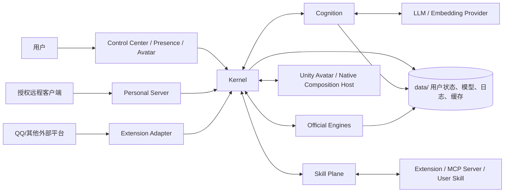

# 系统上下文

> 范围：Glimmer Cradle 与用户、桌面平台、外部服务、本机资源和生态能力之间的边界；不展开内部源码结构。
> 事实依据：仓库目录、`products/`、`protocol/`、`configs/`、已安装扩展目录、Desktop/Server/Kernel/Cognition/Engine 实现与架构蓝图。
> 维护触发：新增用户入口、外部平台、provider、模型服务、数据域、扩展入口或发行形态。



## 外部参与者

| 参与者 | 进入 Glimmer Cradle 的边界 | 架构要求 |
|---|---|---|
| 用户 | Control Center、Presence、Avatar、语音输入、平台消息 | 输入先规范化为受控事件；输出按文本、语音、身体表达分离 |
| Personal Server 客户端 | 受认证 HTTP/WebSocket ingress | 不接触 Kernel 动态端点；非回环部署必须配置 token，并由反向代理承担 TLS |
| 桌面系统 | Electron main、preload、Native Composition Host、系统托盘、文件/窗口 API | 原生对象留在 main/native，不穿透到 renderer 或 Cognition |
| 外部平台 | Extension Adapter，例如 QQ/NapCat | Adapter 只做平台 payload 归一化和权限边界，不传平台私有结构给 Cognition |
| LLM/Embedding Provider | Cognition provider 配置和调用策略 | LLM 失败要可诊断；Embedding 是显式启用的可选增强，失败不破坏基础召回或认知循环 |
| 官方 Engine | `engines/` 下的本体能力执行器，如 audio | 由 Kernel 监督，作为官方能力，不作为 Extension 安装 |
| Extension/MCP | Skill Plane Provider | 通过 manifest/config 声明、通过 Policy 授权、通过 Gateway 调用 |
| 本机数据域 | `data/`、系统 user-data、模型目录、日志目录 | 用户连续性、模型、缓存、构建投影和迁移源分域管理 |

## 输入与输出语义

当前角色的输入不直接等于聊天消息。文本、语音、平台事件、桌面上下文、工具结果都要先归一化为当前角色能理解的感知或能力结果，再由 Cognition 进入认知循环。输出也不只有 reply：可能是文本回复、语音播放、情绪快照、思考状态、身体动作、工具调用或平台动作。

平台输入的基本链路是：

```text
外部平台/桌面表面
  -> Adapter 或 preload 白名单 API
  -> Kernel 规范化与 trace 延续
  -> Cognition perception / action loop
  -> Kernel 状态投影与能力调用
  -> Surface / Adapter 受控输出
```

这条链路保证平台细节不会污染人格核，Renderer 不会推断系统事实，Extension 不会绕过权限与审计。

## 信任边界

- `configs/secrets/` 与环境变量是密钥边界；普通配置、manifest、日志和文档都不是密钥存储。
- Renderer 只通过 preload 暴露的白名单 API 与 Electron main 交互；禁止直接使用 Node API 或任意路径访问。
- MCP Server 和 Extension 是可选且可失败的外部能力来源；它们的工具结果必须作为不可信输入处理。
- LLM provider 输出不能直接修改事实源；写入记忆、经历或用户状态必须经过 Cognition 明确语义和持久化路径。

## 与蓝图的关系

蓝图把 Glimmer Cradle 描述为“认知核 + 中枢监督树 + 身体 + 能力生态 + 记忆脊柱”。当前系统上下文保持这个审美：Kernel 不抢夺灵魂，Cognition 不伸手触摸平台，身体不是 UI 装饰，扩展不是核心器官，数据不是散落缓存。任何新增外部参与者都必须先说明它接入的是哪个边界，而不是直接把依赖塞进最方便的进程。

相关：[运行拓扑](./03-运行拓扑与进程边界.md)、[Protocol Reference](../../reference/protocol.md)、[Extension SDK Reference](../../reference/extension-sdk.md)。
