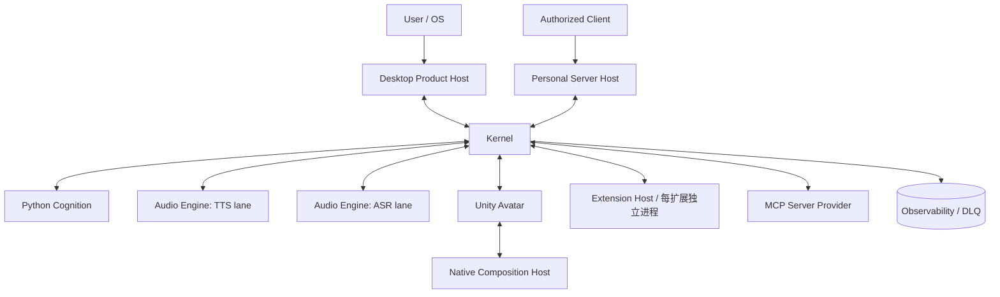

# 运行拓扑与进程边界

> 范围：主要运行时、进程/故障域、生命周期 owner、readiness 与降级关系；不列每个类的实现细节。
> 事实依据：`products/desktop/`、`products/personal-server/`、`core/kernel/`、`core/cognition/`、`engines/`、`native/`、已安装扩展目录、`configs/system/*.yaml`。
> 维护触发：新增 runtime、子进程、端口、启动阶段、依赖关系、ready 条件、日志位置或故障策略。

Kernel 是本体能力的 composition root。`scripts/launch-product.mjs` 是产品组合监督者，按 `products/desktop/product.json` 或 `products/personal-server/product.json` 共同持有 Kernel 与产品 Host 的进程树，但不参与业务路由或 readiness 判断。其他进程不能绕过 Kernel 建立隐式控制关系。

## 运行时边界

| Runtime | 主要 owner | 独立原因 | ready 条件 |
|---|---|---|---|
| Kernel | TypeScript Kernel 进程 | 生命周期中枢、协议路由、能力编排、状态投影 | 基础设施、配置、传输、Application 服务与 required SDK 状态已解释 |
| Cognition | Python 认知核 | 人格、情绪、记忆、推理依赖 Python AI 生态，故障应隔离 | IPC 握手、配置加载、持久化/记忆基础设施、认知循环可服务 |
| Electron Desktop | Electron main + renderer | 桌面窗口、托盘、preload、UI 状态投影 | main 启动、preload API 可用、与 Kernel 状态投影连接或进入等待态 |
| Personal Server | Node HTTP/WebSocket Host | 无桌面部署、远程认证、外部 ingress 与 Kernel 回环端点隔离 | HTTP listener 可服务，并持续观察到 `kernel.ingress` 与全部 blocking runtime 为 `ready`；非回环绑定必须有 token |
| Unity Avatar | Unity worker | 复杂 Live2D/未来 3D 身体、动作、口型、首帧渲染 | `host_hello` 后完成 catalog、SDK、模型 driver、Composition Host 首帧并发送 `host_ready` |
| Native Composition Host | native C/C++ 平台适配 | 透明合成、DPI、多显示器、命中和共享 surface 是平台原语 | 原生窗口、surface attach、首帧 present 和命中策略可用 |
| Audio Engine | Python `engines/audio` stdio | TTS/ASR 模型依赖与冷启动独立于 Kernel | 资源 catalog、依赖、模型 warmup 和 engine 协议健康检查完成或明确 degraded |
| Extension Host | 每个启用 Extension 的独立 Node 子进程 | 可安装生态能力需要独立依赖与故障域 | manifest 校验、Worker ready、权限约束的 Port RPC、激活和 disposable 生命周期建立 |
| MCP Server Provider | stdio/http/ws 外部工具服务 | 外部 server 不可信、可断连、需要超时和重连 | initialize、枚举 tools/resources/prompts 成功，并进入 catalog |

## 启动阶段

当前启动应按依赖语义理解，而不是按源码目录机械排序：

1. **Foundation**：加载配置、路径 resolver、日志、trace、DLQ、数据域。
2. **Transport**：建立 Kernel 对外和内部通信通道，例如 IPC/WebSocket/stdio 管道。
3. **Application**：组装领域服务、Application service、Skill Plane、状态投影。
4. **Presentation**：按产品组合发布 Control Surface/Avatar 动态回环端点，产品 Host 可进入等待态。
5. **Core Readiness**：等待 Cognition 和必要传输真实 ready；随后开放文本 Ingress。
6. **Background Capabilities**：Audio warmup、Avatar ready、Extension/MCP/User Provider 在后台独立收敛；失败只降级所属能力。
7. **Organism**：启动主动行为和持续调度，不反向阻塞已开放的直接对话。

同一阶段只有无依赖 runtime 可以并行。任何 runtime 都必须声明唯一 ID、owner、依赖、blocking/degradable 属性、ready 条件、timeout、restart/stop 策略和日志位置。

## 内部端点

Kernel 的 Cognition RPC、Control Surface Gateway 和 Avatar Host 都绑定 `127.0.0.1` 动态端口。`EndpointRegistry` 将本代 owner PID、generation、purpose 和 endpoint 原子写入 `data/run/host/endpoints.json`；Desktop、Personal Server、Cognition 和 Unity 只消费本代端点。普通配置不再暴露这些端口，最后一个端点撤销或停机时删除 catalog。Personal Server 通过自己的受认证 ingress 暴露服务，不能把内部端点改成外网绑定。

第三方协议端点由所属 Adapter 管理，不冒充 Kernel 内部端点。NapCat OneBot 默认自动选择空闲回环端口，并在扩展进程内同步给受管 NapCat 和 bridge；WebUI 等明确的用户管理面仍由 Extension Capability Graph 报告状态。

## readiness 与 degraded

进程存在不等于可用。典型区分如下：

Personal Server 的 `/healthz` 只表达 Product Host 进程和 HTTP listener 存活；`/readyz` 通过内部 Control Surface 持续消费 Kernel 的 canonical runtime catalog。只有 `kernel.ingress=ready` 且全部 blocking runtime 为 `ready` 时才返回 `200`。端点尚未发布、Control Surface 断连或 catalog 失去权威观测时立即撤销 ready，不能沿用最后一次成功快照。

- Electron 窗口存在，只说明 UI surface 可见；Kernel 未 ready 时只能显示等待态。
- Unity 进程连接，只说明协议通道建立；Live2D 模型、Composition Host 和首帧未完成时不能报告身体 ready。
- Audio engine 响应 `health` 只说明协议通；TTS/ASR 默认未启用且不参与基础 readiness，显式启用后的 warmup 失败必须显示对应 provider unavailable/degraded。
- MCP server 进程存在，只说明子进程启动；initialize 和 catalog 枚举失败时不能留下 ready skill。
- Extension 激活完成，只说明入口执行；注册的能力必须经过 Policy 和 Gateway 才可调用。

## 停机与重启

停机按依赖逆序执行：先关闭用户输入和可选 provider，再停止 surface/engine/cognition，最后释放 Kernel 基础设施。受管子进程应先收到协议级 shutdown；Control Surface 在关闭连接前向 Product Host 发送下行 `shutdown`，Personal Server 据此自主关闭 HTTP/WebSocket listener。Product Supervisor 在正常主进程退出后为兄弟进程保留短暂自然退出窗口，超时后才回收进程树。Windows 使用进程树回收，本地 Linux 的受管 Host 使用独立进程组，云端由容器/cgroup 与编排器提供最终边界。停机只等待短时 flush/checkpoint/seal，不运行长期记忆推理；期限结束必须允许立即终止，持久待办随后恢复。

重启策略只适用于可以安全重建的 runtime。Cognition、Audio、Avatar 或 MCP server 重启后，Kernel 必须重新建立握手、ready 和 catalog 状态；不能复用旧 handler、旧端口或旧状态投影。

当前 Cognition state 是单写者 SQLite 形态，适用于桌面与单实例 Linux；数据库、`-wal` 和 `-shm` 必须位于同一持久卷。该形态不是多 Pod 共享数据库方案。未来横向扩展必须切换到服务端持久化与 claim/lease Worker，不能把 SQLite 放在网络文件系统上让多个实例同时消费。

相关：[子系统当前视图](./07-子系统当前视图/README.md)、[Kernel 与 Runtime 实现](../implementation/Kernel与Runtime实现.md)、[日志、Trace 与 DLQ 排障](../../guides/operations/日志、Trace与DLQ排障.md)。
