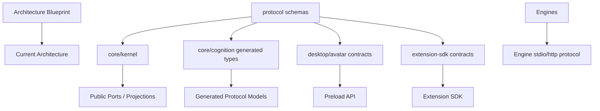

# 构件、分层与依赖

> 范围：仓库主要构件、逻辑分层、允许依赖方向和禁止跨层方式；不展开逐文件 API。
> 事实依据：workspace 包、`products/`、`protocol/`、`core/`、`engines/`、`native/`、已安装扩展目录、生成物和当前实现。
> 维护触发：新增包、公开 SDK、跨进程契约、Composition Root、Extension 边界或依赖方向变化。

## 顶层构件

| 构件 | 职责 | 不承担 |
|---|---|---|
| `protocol/` | JSON Schema、生成器、TS/Python 投影、跨语言/跨进程共享模型 | TS-only 便利类型、UI view model、手写镜像 |
| `core/kernel/` | 生命周期、Ingress Gate、协议路由、Application 服务、Skill Plane、状态投影 | 人格判断、记忆语义、窗口渲染、模型内部编排 |
| `core/cognition/` | 人格、情绪、经历、记忆、巩固、推理、计划、行动语义 | 平台 IO、窗口控制、扩展进程管理、桌面 API |
| `products/desktop/` | Glimmer Cradle Desktop 产品组合；Electron main/preload/React Control Center/Presence；main 承担 OS 边界 | Renderer 读取原始配置、决定系统事实、直接调用模型或 Cognition 私有接口 |
| `products/personal-server/` | Glimmer Cradle Personal Server 产品组合；受认证 HTTP/WebSocket ingress 与无桌面部署入口 | Cognition 语义、Kernel 私有对象、桌面窗口与 Avatar Host |
| `core/avatar/unity-host/` | 正式复杂身体渲染、动作、口型、Unity SDK、Avatar 协议客户端 | Control Center、Kernel 生命周期总控、平台配置事实源 |
| `engines/` | 官方模型/媒体能力执行器，例如 audio TTS/ASR | 全局业务编排、可安装生态、人格判断 |
| `native/` | 可复用平台原语、FFI、Composition Host、性能热路径 | 产品配置、状态投影、跨进程协议 owner |
| `data/packages/extensions/<id>/<version>/` | 已安装扩展发布物，只由 Extension Host 发现和加载 | 扩展源码、Kernel 内部对象、本体核心器官 |
| `configs/` | 系统默认配置、Cognition 配置、Extension 配置入口 | 密钥明文、运行缓存、用户连续性数据库 |
| `data/` | 本机用户状态、模型、日志、缓存、构建投影、备份 | 源码事实源、安装目录、Git 管理内容 |

## 允许依赖方向

规则：

- 两个语言或进程共享结构时，先定义 Schema，再生成投影；不得在消费者里复制字段。
- Application service 可以依赖领域服务和 Port；领域层不得依赖 Electron、Unity、provider SDK 或外部平台 SDK。
- Composition Root 可以组装具体实现；普通业务代码不得到处 new 基础设施对象。
- Renderer 消费 preload API 和 Kernel 投影；不得 import Kernel 包、读本机任意路径或解析 YAML 原始事实。
- Extension 消费 `@glimmer-cradle/extension-sdk`；不得 import `core/kernel/src/**`。
- Engine 通过受控协议与 Kernel 交互；不得回调 UI 或直接写 Cognition 私有状态。

## 分层判断

| 问题 | 应放位置 |
|---|---|
| “这个字段两个进程都要理解” | `protocol/src/schemas/` |
| “这个状态决定系统能否接受输入” | Kernel lifecycle / readiness |
| “这个输入对当前角色意味着什么” | Cognition |
| “这个按钮如何展示保存中/失败/需要重启” | Desktop renderer，消费 Kernel/config 投影 |
| “这个平台消息如何变成统一感知” | Extension Adapter 或平台 Port |
| “这个工具调用是否允许” | Skill Plane Policy / Invocation Gateway |
| “这个模型文件如何下载、预热、诊断” | Engine resource catalog + Kernel capability runtime |
| “这个窗口如何透明、穿透、DPI 适配” | Avatar / Native Composition Host |

## 禁止的影子架构

- UI 组件持有自己的“Kernel 状态真相”，只在需要时同步。
- Cognition 为了方便直接读桌面窗口、剪贴板或外部平台 payload。
- Extension 注册时顺手拿到内部 service 实例，绕过 SDK Port。
- MCP 或 provider 的远端 schema 被当成项目协议直接传给 Cognition。
- Engine 把模型下载结果写进源码目录或安装目录。
- 为了兼容旧字段，在 producer 和 consumer 间保留无期限双轨。

代码入口见 [技术实现地图](../implementation/README.md)；精确字段见 [Protocol Reference](../../reference/protocol.md)；Extension 边界见 [Extension SDK Reference](../../reference/extension-sdk.md)。
