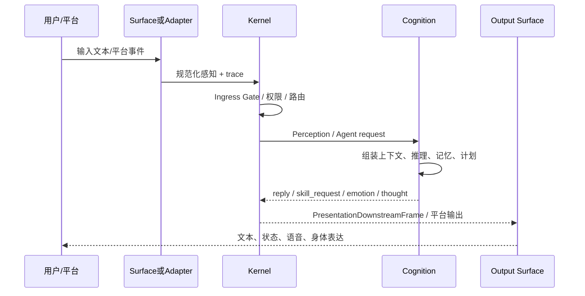

# 关键运行时链路

> 范围：启动、用户输入、认知循环、回复输出、语音、身体、工具调用和停机的主链路；不列字段表。
> 事实依据：Kernel lifecycle、Cognition IPC、Desktop UI controller、Audio runtime、Avatar、Skill Plane 与 Protocol 实现。
> 维护触发：生命周期阶段、Ingress Gate、IPC/WS/stdio 契约、Surface 投影、Skill Plane 调用或 Avatar/Audio 主链变化。

## 目录

- [启动到可服务](#启动到可服务)
- [文本/平台输入到认知回复](#文本平台输入到认知回复)
- [语音输入链路](#语音输入链路)
- [文本回复到语音与身体](#文本回复到语音与身体)
- [Avatar 链路](#avatar-链路)
- [Skill / Tool 调用链路](#skill-tool-调用链路)
- [停机链路](#停机链路)

## 启动到可服务

```text
process start
  -> load config / resolve data domains / start observability
  -> create Kernel services and transport
  -> start Desktop waiting surface
  -> start Cognition and required transport
  -> open text Ingress Gate after core readiness
  -> warm Audio / Avatar / Extension / MCP capabilities in background
  -> continuously publish their ready / degraded snapshots
```

启动链路的关键不是“都启动了”，而是每个能力是否能解释自身状态。Cognition 和必要传输决定文本入口；Audio、Avatar、MCP、Extension 必须把等待资源、连接、握手、warmup、ready、degraded、failed 区分开，并在后台继续收敛。Desktop 可以先出现等待态，文本入口开放后语音或外部集成仍可继续准备，不能用可选能力冷启动拖住正常对话。

## 文本/平台输入到认知回复



一条感知只能由 Cognition 主循环编排一次。平台 Adapter 负责把平台 payload 清洗成当前角色感知；Kernel 负责路由和状态投影；Cognition 负责语义；Surface 负责展示。失败时必须保留同一 trace，且在 UI、日志或 DLQ 中能定位入口和失败阶段。

## 语音输入链路

```text
Control Center recorder
  -> preload sendAudioInput()
  -> Electron main IPC bridge
  -> PresentationUpstreamFrame{kind:'audio_input'}
  -> Kernel ControlSurfaceGateway
  -> data/work/audio/asr/*.wav
  -> AudioService.recognizeSpeech()
  -> engines/audio ASR lane
  -> PresentationDownstreamFrame{kind:'audio_transcript'}
  -> PerceptionAppService 注入统一文本感知
```

识别成功后，文本进入与键盘输入相同的认知链路。识别失败只更新语音输入状态，不伪造当前角色回复，不把 ASR 错误写成 Cognition 的语义失败。

## 文本回复到语音与身体

```text
Cognition reply/emotion/thought
  -> Kernel ControlSurfaceGateway
  -> PresentationDownstreamFrame{kind:'reply'/'emotion'/'thought'}
  -> Desktop UI 投影
  -> AudioService.synthesizeSpeech()
  -> engines/audio TTS lane
  -> data/cache/audio/tts/*.wav
  -> PresentationDownstreamFrame{kind:'audio_play'}
  -> renderer AudioPlaybackController
```

`reply` 是聊天消息；`thought` 是思考状态；`emotion` 是情绪投影；`audio_play` 是声音播放指令。它们共享 trace 但不是同一种消息。Renderer 不应把 thought 写入聊天历史，也不应用本地猜测替代 Kernel 下发的音频或 Avatar 状态。

## Avatar 链路

```text
Kernel
  -> PresentationDownstreamFrame
  -> Unity Avatar
  -> Behavior Controller
  -> Cubism/模型 Driver
  -> Native Composition Host
  -> per-pixel alpha desktop body
```

`host_hello` 只表示连接建立；`host_ready` 表示 catalog 投影、SDK、模型 driver、Composition Host 首帧和交互准备完成。Presence 在 Unity 首选模型时应让位或显示等待/降级，不再悄悄加载另一套复杂身体。动作、口型、视线、idle 与透明命中由 Avatar/Native 边界处理，Control Center 只发受控 intent。

## Skill / Tool 调用链路

```text
Cognition skill_request ActionCommand
  -> Kernel SkillActionController
  -> ready SkillCatalogSnapshot
  -> Cognition agent_plan
  -> SkillPolicyEngine
  -> SkillInvocationGateway
  -> Core / Extension / MCP / User Provider
  -> normalized AgentToolResult
  -> Cognition agent_synthesis
  -> ChannelReplyEvent / 目标 Surface 或 Adapter
```

Cognition 只判断是否需要外部能力并表达原始目标；Kernel 才暴露 ready catalog、执行 policy/gateway 和审计。`contract_only` 能力不可执行，也不会作为 ready 工具进入 planner；需要确认但确认通道未接入的能力必须拒绝而不是偷跑。无 ready skill、无合适 skill、MCP server 断连、工具超时、权限拒绝和 handler 抛错都要返回可诊断结果，并记录 provider、skill、tool、trace 和 policy decision。工具结果回到 Cognition 后才被综合为角色回复，不能直接写成长期记忆事实。

## 停机链路

停机从关闭入口开始，而不是从杀进程开始：

1. 关闭 Ingress Gate，阻止新输入进入认知循环。
2. 通知可选 Extension/MCP/User Skill Provider 停止并撤销 catalog。
3. 停止 Desktop/Avatar/Audio 等 runtime，优先协议级 shutdown。
4. 停止 Cognition，在有界期限内等待 Ledger/数据库 flush 与开放 Episode 封口；不得等待长期记忆模型推理。
5. 释放 Kernel transport、日志、DLQ、计时器、订阅和临时资源。
6. 超时后立即回收受管子进程树，并记录停机诊断；持久待办在下次启动或维护 Worker 中恢复。

相关：[Runtime 与生命周期实现](../implementation/Kernel与Runtime实现.md)、[Protocol 契约层实现](../implementation/Protocol契约层实现.md)、[可观测性 Reference](../../reference/observability.md)。
